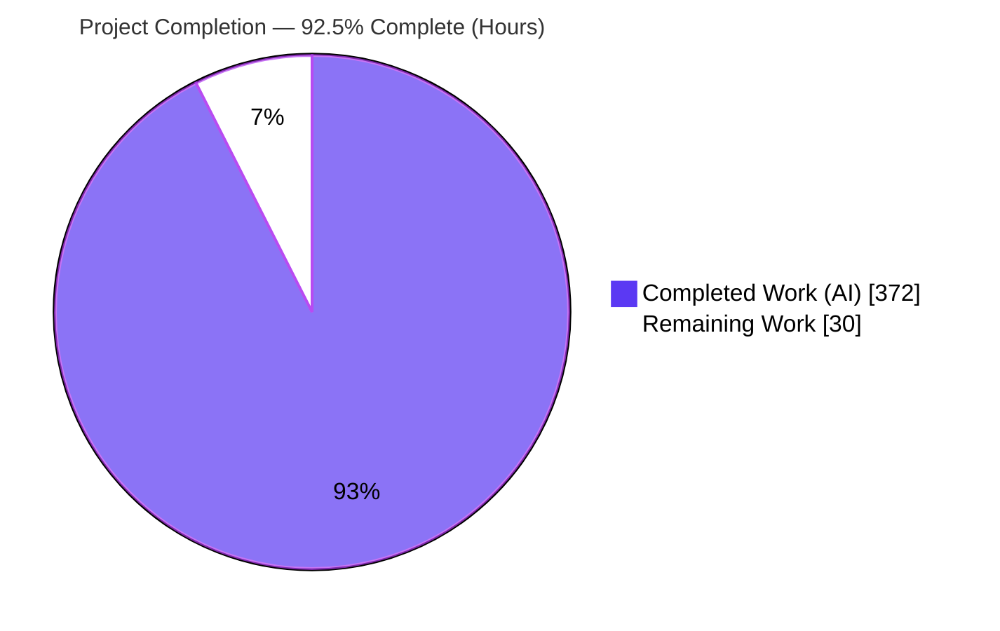
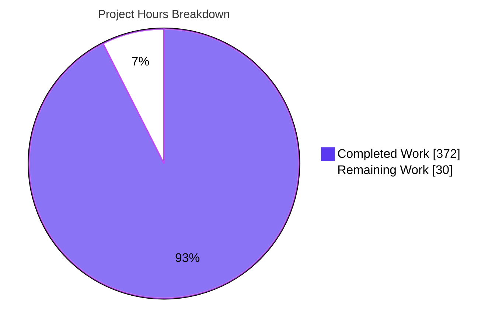
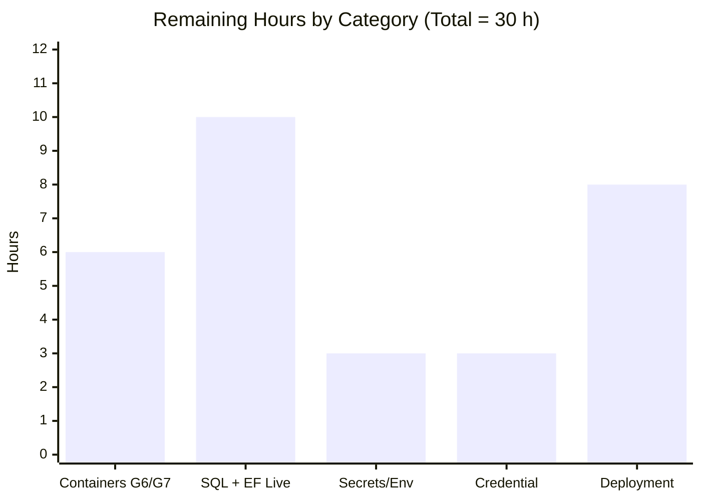

# Blitzy Project Guide — DotNetNuke 4.x → .NET 8 + Angular 19 Migration

> Branch `blitzy-6291c911-271e-448d-9ccd-ab74d9208d04` · HEAD `1d3f592` · Base `00048a2` · Working tree clean
> Generated from the Agent Action Plan (AAP), Final Validator logs, and direct repository/git inspection.

---

## 1. Executive Summary

### 1.1 Project Overview

This project is a full-rewrite tech-stack migration of the legacy DotNetNuke 4.x content-management framework from VB.NET / .NET Framework 2.0 / ASP.NET Web Forms into a modern, decoupled architecture: a C# 12 / .NET 8 LTS Backend-for-Frontend Web API and an Angular 19 single-page application. It delivers functional parity for portal, module, user, role, and permission management while preserving the existing SQL Server schema and multi-tenant (`PortalId`) domain behavior. Data access moves from stored-procedure ADO.NET to Entity Framework Core 8; Forms authentication is replaced by JWT Bearer with BCrypt hashing; both applications are containerized for Linux. Target users are portal administrators and the platform engineering team operating the multi-tenant CMS.

### 1.2 Completion Status

The completion percentage is computed using AAP-scoped, hours-based methodology: **Completed Hours ÷ Total Hours × 100 = 372 ÷ 402 = 92.5%**. The denominator includes only AAP deliverables and standard path-to-production activities.


```mermaid
%%{init: {'theme':'base', 'themeVariables': {'pie1':'#5B39F3','pie2':'#FFFFFF','pieStrokeColor':'#B23AF2','pieStrokeWidth':'2px','pieOuterStrokeWidth':'2px','pieSectionTextColor':'#000000','pieLegendTextColor':'#000000','pieTitleTextSize':'16px'}}}%%
pie showData title Project Completion — 92.5% Complete (Hours)
    "Completed Work (AI)" : 372
    "Remaining Work" : 30
```

| Metric | Value |
|--------|-------|
| **Total Hours** | **402** |
| **Completed Hours (AI + Manual)** | **372** (AI 372 + Manual 0) |
| **Remaining Hours** | **30** |
| **Percent Complete** | **92.5%** |

> All completed work was delivered autonomously by Blitzy agents (40 commits, 100% authored by `agent@blitzy.com`; the Final Validator required zero source-code changes). Manual hours to date = 0.

### 1.3 Key Accomplishments

- ✅ **Full Clean/Onion backend** (188 C# files): `Domain → Application → Infrastructure → Api`, 6 SDK-style .NET 8 projects compiling cleanly under `--warnaserror` (0 warnings / 0 errors).
- ✅ **Domain model migrated**: 19 POCO entities (all 10 AAP-mandated — Portal, Module, User, Role, Tab, Permission, ModulePermission, TabPermission, FolderPermission, UserRole — plus 9 supporting), 6 repository interfaces.
- ✅ **Business logic extracted faithfully** from 5 large legacy controllers (~6,654 VB LOC) into 7 application services, with 15 FluentValidation validators and 7 AutoMapper profiles.
- ✅ **EF Core 8 Code-First to the existing schema**: `DnnDbContext` + 19 `IEntityTypeConfiguration` classes preserving legacy table/column names (e.g., `ToTable("Portals")`, `HasColumnName("PortalID")`); ADO.NET/`SqlHelper` replaced by repositories + UnitOfWork.
- ✅ **Security modernized**: JWT Bearer with refresh rotation and ≥32-byte key fail-fast (replaces `AspNetSqlMembershipProvider`/Forms auth); BCrypt (replaces DES); RFC 7807 ProblemDetails + `{data,meta}` envelope; CorrelationId middleware; CORS restricted to the Angular origin; rate-limited auth endpoints.
- ✅ **Angular 19 SPA** (89 TS files): standalone components + signals, 5 lazy-loaded admin features, shared components, layout, OnPush change detection, typed reactive forms, functional interceptors.
- ✅ **Containerization authored**: `api.Dockerfile`, `frontend.Dockerfile`, `docker-compose.yml`, `nginx.conf` (CSP, SPA fallback, `/api` proxy) + `.env.example`.
- ✅ **889/889 automated tests passing** (454 backend unit + 74 backend integration + 361 frontend; ~93.9% frontend statement coverage) — Gates 1–5 green.
- ✅ **Multi-tenant isolation preserved** (804 `PortalId` references across the backend) and **migration traceability** (1,541 `// MIGRATION:` comments + a 137 KB `MIGRATION_NOTES.md`).

### 1.4 Critical Unresolved Issues

There are **no open code defects**. The items below are path-to-production validation gaps that could not be exercised in the build environment and must be cleared before go-live.

| Issue | Impact | Owner | ETA |
|-------|--------|-------|-----|
| Gates 6 & 7 (container build/startup) never executed — no Docker engine on the Windows host | Container images and orchestration are statically validated only; Linux-specific build/runtime issues remain theoretically possible | DevOps | 0.5 day |
| EF Core mappings verified only against EF Core InMemory, not a live SQL Server schema | Real column type/precision/nullability/FK/identity mismatches could surface at runtime against the actual DNN database | Backend | 1–1.5 days |
| Production secrets (`Jwt:Key`, connection string) not provisioned | API fail-fasts on startup without a ≥32-byte `Jwt:Key`; cannot run against a real database until configured | DevOps | 0.5 day |
| Legacy DES → BCrypt credential transition not operationalized | Existing users' passwords require a rehash-on-login or bulk-migration strategy before they can authenticate | Backend/Security | 0.5 day |

### 1.5 Access Issues

| System / Resource | Type of Access | Issue Description | Resolution Status | Owner |
|-------------------|----------------|-------------------|-------------------|-------|
| Docker engine (Linux) | Build/runtime runner | Absent on the Windows Server host; Gates 6 & 7 cannot be executed here | Open — requires a Linux Docker runner | DevOps |
| SQL Server (existing `DotNetNuke` DB) | Database instance + credentials | Not provisioned; live DB-backed CRUD and EF mapping verification not performed (covered by EF InMemory tests only) | Open — provision instance + connection string | DevOps/DBA |
| `Jwt:Key` signing secret | Runtime secret | Not provisioned (no committed fallback by design); ≥32 bytes required | Open — generate via secret manager | DevOps/Security |
| TLS/HTTPS certificate | Deployment resource | Not provisioned; Kestrel assumes HTTPS is terminated upstream | Open — provision at ingress/reverse proxy | DevOps |

### 1.6 Recommended Next Steps

1. **[High]** Provision a Linux Docker runner and execute Gates 6 & 7 (`docker-compose build`, `docker-compose up -d`, `curl /health` and SPA checks); resolve any Linux-specific issues.
2. **[High]** Provision SQL Server with the existing DNN schema, configure `ConnectionStrings:DefaultConnection`, and verify all 19 EF Core Fluent mappings against the live schema; run a DB-backed CRUD smoke test.
3. **[High]** Provision production secrets — generate a ≥32-byte `Jwt:Key`, populate `docker/.env` from `.env.example`, and set CORS origins / Serilog sink for the target environment.
4. **[Medium]** Implement and validate the DES → BCrypt credential-migration rollout for existing users (rehash-on-login or bulk migration).
5. **[Medium]** Deploy to the target environment (TLS termination, reverse proxy/ingress, CI/CD automation) and run a post-deploy end-to-end smoke test of the authenticated SPA ↔ API ↔ DB flow.

---

## 2. Project Hours Breakdown

### 2.1 Completed Work Detail

Every completed component traces to an AAP requirement. The Hours column sums to **372**, matching Completed Hours in Section 1.2.

| Component | Hours | Description |
|-----------|------:|-------------|
| Domain Layer | 24 | 19 POCO entities (VB `*Info` → C# nullable POCOs, XML-serialization dropped), 6 repository interfaces, `SecurityAccessLevel` enum, `Result`/`DomainException` common types |
| Application — Services | 56 | 7 services (Portal, Module, User, Role, Tab, Auth, PermissionEvaluator); business rules extracted verbatim from 5 legacy controllers (~6,654 VB LOC) |
| Application — DTOs / Mapping / Validation | 20 | Request/response DTOs across 7 areas, 7 AutoMapper profiles, 15 FluentValidation validators |
| Infrastructure — EF Core | 40 | `DnnDbContext`, 19 `IEntityTypeConfiguration` classes (Fluent mapping to existing tables/columns), 6 EF repositories + `UnitOfWork` (replacing `DataProvider`/`SqlHelper`) |
| Infrastructure — Identity | 12 | `JwtService` (issuance + refresh rotation), `PasswordHasher` (BCrypt, replacing DES), `CredentialStore` |
| API Layer | 28 | 8 controllers (thin, delegating), `ExceptionHandlingMiddleware` (RFC 7807), `CorrelationIdMiddleware`, `ProblemDetailsResponseWriter`, `Program.cs` (DI/JWT/CORS/Swagger/rate-limit/HTTPS/Serilog/versioning), `appsettings.json` |
| Backend Unit Tests | 28 | 454 xUnit tests (services, validators, mapping, identity, schema fidelity); 5,457 LOC |
| Backend Integration Tests | 12 | 74 tests via `WebApplicationFactory` + EF Core InMemory; CRUD status-code contract; 2,719 LOC |
| Frontend — Workspace & Core | 18 | Manifests (`package.json`/`angular.json`/`tsconfig*`/`karma`), standalone bootstrap, auth service, JWT/error interceptors, route guard, models, API services |
| Frontend — Features | 40 | 5 admin features (portal, user, role, module, auth) with list/form/detail components + signal-based services |
| Frontend — Shared & Layout | 16 | Reusable `data-table`, `form-controls`, `confirmation-dialog`, `loading-spinner`; header/sidebar/footer layout |
| Frontend — Unit Tests | 22 | 361 Karma/Jasmine tests (ChromeHeadless), ~93.9% statement coverage |
| Containerization Artifacts | 8 | `api.Dockerfile` (multi-stage → `aspnet:8.0-alpine`), `frontend.Dockerfile` (`node:20-alpine` → nginx), `docker-compose.yml`, `nginx.conf`, `.env.example` |
| Documentation | 16 | `MIGRATION_NOTES.md` (137 KB), updated `README.md`, 1,541 `// MIGRATION:` traceability comments |
| Autonomous QA & Validation Cycles | 32 | Iterative checkpoint resolution across 40 commits (CP1–CP4, QA-1/3/4, F2–F10 final acceptance) and gate execution |
| **Total Completed** | **372** | |

### 2.2 Remaining Work Detail

Each remaining category is path-to-production work. The Hours column sums to **30**, matching Remaining Hours in Section 1.2 and the Section 7 pie chart.

| Category | Hours | Priority |
|----------|------:|----------|
| Container Build & Startup validation on a Linux Docker engine (Gates 6 & 7: build, `up -d`, health-check curls, nginx CSP/proxy/networking) | 6 | High |
| SQL Server provisioning + live-schema EF mapping verification (types/nullability/FK/identity) + DB-backed CRUD smoke | 10 | High |
| Production secrets & environment configuration (`Jwt:Key` ≥32B, connection string, CORS origins, `.env`, Serilog sink) | 3 | High |
| Credential migration rollout (legacy DES → BCrypt transition for existing users) | 3 | Medium |
| Deployment to target infrastructure (TLS/HTTPS certs, reverse proxy/ingress, CI/CD automation, post-deploy e2e smoke) | 8 | Medium |
| **Total Remaining** | **30** | |

### 2.3 Hours Reconciliation

| Check | Result |
|-------|--------|
| Section 2.1 Completed total | 372 h |
| Section 2.2 Remaining total | 30 h |
| Total Project Hours (2.1 + 2.2) | **402 h** |
| Percent Complete (372 ÷ 402) | **92.5%** |
| Human task list (High 19 h + Medium 11 h) | 30 h ✓ matches Section 2.2 |

---

## 3. Test Results

All tests below originate from Blitzy's autonomous validation logs for this project. Gates 1 & 2 were additionally reproduced live during this assessment (build clean; 454/454 unit tests).

| Test Category | Framework | Total Tests | Passed | Failed | Coverage % | Notes |
|---------------|-----------|------------:|-------:|-------:|-----------:|-------|
| Backend Unit | xUnit + Moq + FluentAssertions | 454 | 454 | 0 | — | Services, validators, mapping, identity (JWT, PasswordHasher), schema fidelity. Gate 2 ✓ |
| Backend Integration | xUnit + `Microsoft.AspNetCore.Mvc.Testing` + EF Core InMemory | 74 | 74 | 0 | — | CRUD status-code contract POST→201 / GET→200 / PUT→200 / DELETE→204 for Portal, Module, User. Gate 5 ✓ |
| Frontend Unit | Karma + Jasmine (ChromeHeadless) | 361 | 361 | 0 | 93.94% stmt / 80.76% branch / 93.18% func / 93.8% line | Components, services, interceptors, guards. Gate 4 ✓ |
| **Total** | | **889** | **889** | **0** | | **100% pass rate** |

**Build gates (non-test):** Gate 1 API compilation (`dotnet build -c Release --warnaserror`) → 0 warnings / 0 errors ✓; Gate 3 Angular production build (`ng build --configuration production`) → 0 errors / 0 warnings, 371.64 kB initial bundle (under budget) ✓.

**Not executed:** Gate 6 (Container Build) and Gate 7 (Container Startup) — no Docker engine available on the Windows host. Container artifacts were statically validated as production-correct.

---

## 4. Runtime Validation & UI Verification

Runtime smoke tests were performed by the Final Validator on the Release build and the production SPA bundle.

**API (ASP.NET Core 8, Release):**
- ✅ **Operational** — Host starts cleanly and listens on the configured HTTP endpoint.
- ✅ **Operational** — `GET /health` → `200 {"status":"Healthy","version":"1.0.0.0"}` (raw shape, no DB dependency; liveness probe).
- ✅ **Operational** — `GET /swagger/v1/swagger.json` → `200`, OpenAPI 3.0.1, 43 documented paths.
- ✅ **Operational** — `GET /api/portals` without a token → `401` with full RFC 7807 `problem+json` envelope (`type`/`title`/`status`/`detail`/`errors`/`correlationId`/`traceId`), `WWW-Authenticate: Bearer`, `X-Correlation-Id`, CSP `default-src 'none'`, `X-Content-Type-Options: nosniff`, `Cache-Control: no-store` — confirms the full middleware pipeline (CorrelationId → ExceptionHandling/ProblemDetails → security headers → JWT challenge).

**SPA (Angular 19, production `dist` in Chrome 149):**
- ✅ **Operational** — Application bootstraps; router + auth guard redirect unauthenticated `/portals` → `/auth/login`.
- ✅ **Operational** — Login page renders fully and accessibly (skip-link, banner, `h1`, labeled required inputs, button, footer with version) with global SCSS applied and no broken assets.
- ✅ **Operational** — **Zero** browser console errors or warnings.

**Pending live validation (⚠ Partial):**
- ⚠ **Partial** — DB-backed CRUD not exercised against a live SQL Server (covered by EF InMemory integration tests only).
- ⚠ **Partial** — Container runtime (`docker-compose up`) not exercised — no Docker engine on the host.
- ⚠ **Partial** — Full authenticated SPA ↔ API ↔ DB end-to-end flow not run (login render + 401 path verified; authenticated round-trip pending).

---

## 5. Compliance & Quality Review

AAP deliverables cross-mapped to Blitzy quality benchmarks. Fixes were applied autonomously across the QA checkpoint history (CP1–CP4, QA-1/3/4, F2–F10).

| Benchmark / AAP Requirement | Status | Evidence / Notes |
|------------------------------|--------|------------------|
| Language: VB.NET → idiomatic C# 12, nullable enabled | ✅ Pass | 188 C# files; `<Nullable>enable</Nullable>`; CS8618 scoped via `WarningsNotAsErrors` |
| Framework: .NET Framework 2.0 → .NET 8 LTS (SDK-style) | ✅ Pass | 6 SDK-style `net8.0` projects; `global.json` pins SDK 8.0 |
| Presentation: Web Forms → ASP.NET Core 8 Web API + Angular 19 SPA | ✅ Pass | JSON-only API; standalone Angular 19 SPA |
| Data access: ADO.NET → EF Core 8 Code-First to existing schema | ✅ Pass* | 19 Fluent configs preserve legacy names; *live-schema verification pending (R2) |
| Clean/Onion architecture (Domain→Application→Infrastructure→Api) | ✅ Pass | Layer projects + dependency direction enforced |
| Repository + Unit of Work | ✅ Pass | `I*Repository` in Domain; EF implementations + `UnitOfWork` in Infrastructure |
| DTO + AutoMapper (no raw entities returned) | ✅ Pass | 7 profiles; controllers project to DTOs |
| JWT Bearer auth + refresh rotation (replaces Forms/Membership) | ✅ Pass | `JwtService`; ≥32-byte key fail-fast |
| BCrypt password hashing (replaces DES) | ✅ Pass | `PasswordHasher` (BCrypt.Net-Next) |
| RFC 7807 ProblemDetails + `{data,meta}` success envelope | ✅ Pass | `ExceptionHandlingMiddleware` + `ApiControllerBase` |
| CorrelationId middleware | ✅ Pass | `X-Correlation-Id` on requests and logs |
| `/api/v1` URL-path versioning | ✅ Pass | Verified across controllers |
| OpenAPI 3.0 (Swashbuckle) | ✅ Pass | 43 documented paths |
| Multi-tenant `PortalId` isolation preserved | ✅ Pass | 804 backend references; tenant-scoped queries |
| Angular 19 standalone + signals + OnPush + typed forms + lazy routes | ✅ Pass | 5 lazy features; signal-based services |
| Migration traceability (`// MIGRATION:` + `MIGRATION_NOTES.md`) | ✅ Pass | 1,541 comments; 137 KB notes incl. documented-but-unfixed bugs |
| Legacy schema unaltered; legacy source untouched | ✅ Pass | 634 `.vb` files unchanged; 0 legacy edits |
| Gate 1 clean compile under `--warnaserror` | ✅ Pass | 0 warnings / 0 errors |
| Gates 2 / 4 / 5 unit & integration tests 100% | ✅ Pass | 454 / 361 / 74 all green |
| Gate 3 Angular production build | ✅ Pass | 0 errors/warnings |
| Gates 6 / 7 container build & startup | ⏳ Pending | Env-blocked (no Docker engine); artifacts statically validated |
| Dependency versions match AAP §0.5.1 | ✅ Pass | `dotnet restore`/`npm ci` exit 0; versions pinned exactly |

---

## 6. Risk Assessment

| Risk | Category | Severity | Probability | Mitigation | Status |
|------|----------|----------|-------------|------------|--------|
| Live-schema EF mapping drift — mappings verified only vs EF InMemory (no real type/nullability/FK/identity enforcement) | Technical | High | Medium | Provision SQL Server; verify 19 mappings against live schema; DB CRUD smoke (R2) | Open |
| Container build/startup unverified on Linux (Gates 6/7 static-only) — casing/base-image/healthcheck-timing risk | Technical | Medium | Low–Medium | Execute on a Linux Docker runner (R1) | Open |
| .NET 8 LTS support ends 2026-11-10 | Technical | Low | High (eventual) | Plan a .NET 10 LTS upgrade post-deployment | Monitored |
| Secrets management — `Jwt:Key`/connection string runtime-only, not provisioned | Security | High | Low | Provision via secret manager; ≥32-byte key (fail-fast control already present) (R3) | Open |
| Credential transition DES → BCrypt not operationalized for existing users | Security | Medium | Medium | Rehash-on-login or bulk migration (R4) | Open |
| HTTPS/TLS termination not provisioned (Kestrel assumes upstream termination) | Security | Medium | Medium | Provision TLS at ingress/reverse proxy (R5) | Open |
| Production Serilog log sink/aggregation not configured | Operational | Low–Medium | Medium | Configure sink during deployment (R5) | Open |
| `/health` is liveness-only (no DB readiness probe) | Operational | Low | Medium | Optionally add a DB-readiness probe at deployment | Backlog |
| No CI/CD pipeline (none in legacy repo; none created) | Operational | Low–Medium | High | Build pipeline as part of deployment (R5) | Open |
| Live DB integration untested end-to-end (EF InMemory only) | Integration | High | Medium | Live SQL Server smoke (R2) | Open |
| Full SPA ↔ API ↔ DB e2e flow not exercised (unit tests mock HttpClient) | Integration | Medium | Medium | Post-deploy e2e smoke (R1/R5) | Open |
| CORS production origin must be set correctly or SPA calls fail | Integration | Low | Medium | Set allowed origin via env config (R3) | Open |

---

## 7. Visual Project Status

**Hours distribution (Completed vs Remaining):**


```mermaid
%%{init: {'theme':'base', 'themeVariables': {'pie1':'#5B39F3','pie2':'#FFFFFF','pieStrokeColor':'#B23AF2','pieStrokeWidth':'2px','pieOuterStrokeWidth':'2px','pieSectionTextColor':'#000000','pieLegendTextColor':'#000000','pieTitleTextSize':'16px'}}}%%
pie showData title Project Hours Breakdown
    "Completed Work" : 372
    "Remaining Work" : 30
```

> Color key: **Completed = Dark Blue `#5B39F3`**, **Remaining = White `#FFFFFF`**. "Remaining Work" (30 h) equals Section 1.2 Remaining Hours and the Section 2.2 total.

**Remaining hours by category (Section 2.2):**


```mermaid
xychart-beta
    title "Remaining Hours by Category (Total = 30 h)"
    x-axis ["Containers G6/G7", "SQL + EF Live", "Secrets/Env", "Credential", "Deployment"]
    y-axis "Hours" 0 --> 12
    bar [6, 10, 3, 3, 8]
```

**Remaining work by priority:** High = 19 h (containers, live SQL/EF, secrets) · Medium = 11 h (credential rollout, deployment).

---

## 8. Summary & Recommendations

**Achievements.** The DotNetNuke 4.x core has been fully rewritten into a clean, modern, two-tier stack and is **92.5% complete** on an AAP-scoped, hours basis (372 of 402 hours). All AAP code deliverables are implemented, all five executable validation gates pass at 100% (**889/889 automated tests**), and both applications start and run correctly in smoke tests. The migration preserves multi-tenant isolation and the user → role → permission model, maps EF Core to the existing schema without altering it, and modernizes security (JWT Bearer + BCrypt, RFC 7807, correlation IDs). Migration discipline was exemplary: the legacy `Library/`/`Website/` trees (634 `.vb` files) were left untouched as reference, with 1,541 `// MIGRATION:` comments and a 137 KB `MIGRATION_NOTES.md` documenting decisions and known legacy bugs.

**Remaining gaps (30 h).** The outstanding work is exclusively path-to-production and is not caused by code defects: (1) execute container Gates 6 & 7 on a Linux Docker engine; (2) provision SQL Server and verify EF mappings against the live schema with a DB-backed CRUD smoke; (3) provision production secrets and environment configuration; (4) operationalize the DES → BCrypt credential transition; (5) deploy with TLS, a reverse proxy, and CI/CD.

**Critical path to production.** Linux Docker validation (Gates 6/7) and live SQL Server verification are the two highest-value, highest-risk activities and should be sequenced first — they retire the top technical/integration risks (EF mapping drift; container runtime). Secrets provisioning is a fast prerequisite that unblocks any live run.

**Success metrics for go-live.** Gates 6 & 7 green on Linux; live CRUD smoke passing against the real schema; authenticated SPA ↔ API ↔ DB e2e flow verified; secrets provisioned and TLS enforced at the edge.

**Production readiness assessment.** The codebase is **build- and test-ready** and structurally production-grade. It is **not yet deployed or live-validated**. With the ~30 hours of path-to-production work above (≈3–4 focused engineering days), the system is positioned for a confident production release.

---

## 9. Development Guide

### 9.1 System Prerequisites

| Requirement | Version | Purpose |
|-------------|---------|---------|
| .NET SDK | 8.0.x (pinned via `global.json`, `rollForward: latestMinor`) | Build/test/run the backend |
| Node.js | 20 LTS (verified v20.20.2) | Build/test the Angular SPA |
| npm | 10.x (verified 10.8.2) | Frontend dependency install |
| Google Chrome / Chromium | Recent | `ChromeHeadless` for Gate 4 (`ng test`) |
| Docker + Docker Compose | Recent (Linux engine) | Gates 6 & 7 (container build/startup) — **Linux engine required** |
| SQL Server | 2016+ (or Azure SQL) | Live database for the existing `DotNetNuke` schema |

Verify the core toolchain:

```bash
dotnet --version      # 8.0.x
dotnet --list-sdks    # must include an 8.0.x SDK
node --version        # v20.x
npm --version         # 10.x
```

### 9.2 Environment Setup

```bash
# 1. Clone and switch to the migration branch
git clone <repository-url>
cd <repository-root>
git checkout blitzy-6291c911-271e-448d-9ccd-ab74d9208d04

# 2. Create the runtime secrets file for containers (NEVER commit docker/.env)
cd docker
cp .env.example .env
#   Edit docker/.env and set:
#     CONNECTION_STRING=Server=<host>,1433;Database=DotNetNuke;User Id=<user>;Password=<pwd>;TrustServerCertificate=True;Encrypt=False
#     JWT_SECRET=<>=32-byte high-entropy secret>     # generate: openssl rand -base64 48
#     # CORS_ORIGIN=https://your-spa-host            # optional; defaults to http://localhost:4200
cd ..
```

For **local (non-container) runs**, supply the same values to the API via environment variables or `appsettings.Development.json` (`ConnectionStrings:DefaultConnection`, `Jwt:Key`). The API **fail-fasts at startup if `Jwt:Key` is missing or shorter than 32 bytes** — this is the intended secure default.

### 9.3 Dependency Installation

```bash
# Backend (NuGet)
dotnet restore backend/DnnMigration.sln          # → exit 0

# Frontend (npm, lockfile-exact)
cd frontend
npm ci                                            # → exit 0 (~951 packages)
cd ..
```

### 9.4 Build (Gates 1 & 3)

```bash
# Gate 1 — API compilation (zero warnings/errors under --warnaserror)
dotnet build backend/DnnMigration.sln --configuration Release --warnaserror
#   → "Build succeeded. 0 Warning(s) 0 Error(s)"  (verified this session)

# Gate 3 — Angular production build
cd frontend
ng build --configuration production               # → 0 errors/warnings; dist/.../browser produced
cd ..
```

> On Windows, if you encounter MSBuild `MSB4166` (child node exited prematurely), add `/p:UseSharedCompilation=false` and set `MSBUILDDISABLENODEREUSE=1`.

### 9.5 Test (Gates 2, 4, 5)

```bash
# Gate 2 — API unit tests (454)
dotnet test backend/tests/DnnMigration.UnitTests/DnnMigration.UnitTests.csproj --configuration Release
#   → "Passed!  Failed: 0, Passed: 454, Total: 454"  (verified this session)

# Gate 5 — API integration tests (74; CRUD status-code contract)
dotnet test backend/tests/DnnMigration.IntegrationTests/DnnMigration.IntegrationTests.csproj --filter "Category=Integration" --configuration Release
#   → 74/74 passing

# Gate 4 — Angular unit tests (361) with coverage
cd frontend
ng test --watch=false --browsers=ChromeHeadless --code-coverage
#   → "TOTAL: 361 SUCCESS"
cd ..
```

### 9.6 Application Startup

**Option A — Local processes (requires SQL Server + `Jwt:Key`):**

```bash
# Terminal 1 — API
cd backend/src/DnnMigration.Api
dotnet run --configuration Release
#   API listens on the configured HTTP port (e.g., http://localhost:5080)

# Terminal 2 — SPA dev server
cd frontend
ng serve
#   SPA on http://localhost:4200 (proxies /api to the API)
```

**Option B — Containers (Gates 6 & 7; requires a Linux Docker engine + populated `docker/.env`):**

```bash
cd docker
docker-compose build                              # Gate 6 → both images built
docker-compose up -d                              # Gate 7 → api + frontend running
```

### 9.7 Verification

```bash
# API liveness (Gate 7 contract)
curl -f http://localhost:8080/health
#   → 200 {"status":"Healthy","version":"1.0.0.0"}

# OpenAPI document
curl -f http://localhost:8080/swagger/v1/swagger.json    # → 200 (OpenAPI 3.0.1)

# SPA
curl -f http://localhost:4200                            # → 200
```

(For a local Option-A run, substitute the API's actual port, e.g. `:5080`.)

### 9.8 Example Usage

```bash
# 1. Authenticate (returns access + refresh tokens in the {data,meta} envelope)
curl -s -X POST http://localhost:8080/api/v1/auth/login \
  -H "Content-Type: application/json" \
  -d '{"username":"<user>","password":"<password>","portalId":0}'

# 2. List portals (Bearer token required; otherwise 401 + RFC 7807 problem+json)
curl -s http://localhost:8080/api/v1/portals \
  -H "Authorization: Bearer <accessToken>"
#   → 200 { "data": [ ... ], "meta": { "count": N } }

# 3. Create a portal
curl -s -X POST http://localhost:8080/api/v1/portals \
  -H "Authorization: Bearer <accessToken>" -H "Content-Type: application/json" \
  -d '{"portalName":"Acme","...":"..."}'
#   → 201 Created
```

### 9.9 Troubleshooting

| Symptom | Likely Cause | Resolution |
|---------|--------------|------------|
| API exits immediately at startup | `Jwt:Key` missing or `< 32` bytes (intended fail-fast) | Set a ≥32-byte `Jwt:Key` (env var or `appsettings.Development.json`); generate via `openssl rand -base64 48` |
| `401` on every API call | Missing/expired Bearer token | Call `/api/v1/auth/login` and send `Authorization: Bearer <token>` |
| SPA calls blocked by CORS | Allowed origin mismatch | Set `CORS_ORIGIN` / `Cors:AllowedOrigins` to the SPA origin |
| DB connection / EF errors at runtime | Connection string wrong, or live schema differs from Fluent mappings | Verify `ConnectionStrings:DefaultConnection`; compare the 19 EF configs against the live schema (column types/nullability/FK) |
| `docker-compose` unavailable | No Docker engine (e.g., on Windows Server) | Run Gates 6 & 7 on a Linux Docker runner |
| MSBuild `MSB4166` on Windows | Roslyn shared-compilation worker reuse | `MSBUILDDISABLENODEREUSE=1` + `/p:UseSharedCompilation=false` |
| `ng test` cannot find a browser | Chrome/Chromium not installed | Install Chrome or set `CHROME_BIN` to a Chromium binary |

---

## 10. Appendices

### Appendix A — Command Reference

| Command | Purpose |
|---------|---------|
| `dotnet restore backend/DnnMigration.sln` | Restore NuGet packages |
| `dotnet build backend/DnnMigration.sln -c Release --warnaserror` | Gate 1 — clean compile |
| `dotnet test .../DnnMigration.UnitTests... -c Release` | Gate 2 — 454 unit tests |
| `dotnet test .../DnnMigration.IntegrationTests... --filter "Category=Integration"` | Gate 5 — 74 integration tests |
| `npm ci` (in `frontend/`) | Lockfile-exact dependency install |
| `ng build --configuration production` | Gate 3 — Angular production build |
| `ng test --watch=false --browsers=ChromeHeadless --code-coverage` | Gate 4 — 361 frontend tests |
| `dotnet run --configuration Release` (in `backend/src/DnnMigration.Api`) | Run the API |
| `docker-compose build` / `docker-compose up -d` (in `docker/`) | Gates 6 & 7 — containers |
| `curl -f http://localhost:8080/health` | Health/liveness check |

### Appendix B — Port Reference

| Service | Host Port | Container Port | Notes |
|---------|-----------|----------------|-------|
| API (Kestrel) | 8080 | 8080 | `ASPNETCORE_URLS=http://+:8080`; HTTPS terminated upstream |
| Frontend (nginx-unprivileged) | 4200 | 8080 | nginx worker runs as non-root (uid 101) |
| API local dev run | 5080 | — | Default for `dotnet run` in Development |
| SPA dev server (`ng serve`) | 4200 | — | Local development only |

### Appendix C — Key File Locations

| Path | Purpose |
|------|---------|
| `backend/DnnMigration.sln` | Backend solution (6 projects) |
| `backend/src/DnnMigration.Domain/` | Entities, repository interfaces, enums, common |
| `backend/src/DnnMigration.Application/` | Services, DTOs, AutoMapper profiles, validators |
| `backend/src/DnnMigration.Infrastructure/` | `DnnDbContext`, EF configurations, repositories, identity, DI |
| `backend/src/DnnMigration.Api/` | Controllers, middleware, `Program.cs`, `appsettings.json` |
| `backend/tests/` | `DnnMigration.UnitTests`, `DnnMigration.IntegrationTests` |
| `frontend/src/app/{core,shared,features,layout}/` | Angular SPA |
| `docker/` | `api.Dockerfile`, `frontend.Dockerfile`, `docker-compose.yml`, `nginx.conf`, `.env.example` |
| `MIGRATION_NOTES.md` | Migration decision log + documented-but-unfixed legacy bugs |
| `global.json` | Pins .NET 8 SDK |
| `Library/`, `Website/` | **Legacy DNN 4.x source — reference only, untouched** |

### Appendix D — Technology Versions

| Technology | Version |
|------------|---------|
| .NET / C# | .NET 8 LTS (`net8.0`) / C# 12 (nullable enabled) |
| EF Core (SqlServer/Design/Tools/InMemory) | 8.0.11 |
| Microsoft.AspNetCore.Authentication.JwtBearer / OpenApi | 8.0.11 |
| Swashbuckle.AspNetCore | 6.9.0 |
| AutoMapper.Extensions.Microsoft.DependencyInjection | 12.0.1 |
| FluentValidation.AspNetCore | 11.3.0 |
| Serilog.AspNetCore / Sinks.Console | 8.0.3 / 6.0.0 |
| BCrypt.Net-Next | 4.0.3 |
| xUnit / runner.visualstudio / Moq / FluentAssertions | 2.9.2 / 2.8.2 / 4.20.72 / 6.12.2 |
| Angular | 19.2.x |
| Node.js / npm | 20 LTS / 10.x |
| Karma / Jasmine-core / TypeScript | 6.4.4 / 5.4.0 / 5.6.x |
| Container bases | `aspnet:8.0-alpine`, `sdk:8.0`, `node:20-alpine`, `nginx-unprivileged:alpine` |

### Appendix E — Environment Variable Reference

| Variable | Maps To | Required | Notes |
|----------|---------|----------|-------|
| `CONNECTION_STRING` | `ConnectionStrings:DefaultConnection` | Yes (runtime) | Existing `DotNetNuke` SQL Server DB; schema mapped, not altered |
| `JWT_SECRET` | `Jwt:Key` | Yes (runtime) | **≥32 bytes**; API fail-fasts otherwise; `openssl rand -base64 48` |
| `CORS_ORIGIN` | `Cors:AllowedOrigins[0]` | No | Defaults to `http://localhost:4200`; set to the real SPA origin in prod |
| `ASPNETCORE_URLS` | Kestrel binding | No | `http://+:8080` in containers |
| `ASPNETCORE_ENVIRONMENT` | Hosting environment | No | `Production` / `Development` |

> Secrets have **no committed fallback defaults** by design. Never commit `docker/.env`; only `.env.example` (placeholders) is tracked.

### Appendix F — Developer Tools Guide

- **NuGet cache**: warm cache speeds `dotnet restore`; the build resolves the 8.0.x SDK via `global.json`.
- **Static analysis**: `dotnet build --warnaserror` is the authoritative C# quality gate (no separate `.editorconfig`/lint script in the repo). `ng build` is the authoritative frontend gate.
- **Read-only checks**: `dotnet format --verify-no-changes` reports only unadopted default-ruleset whitespace opinions on pre-existing files — not a project gate; do not reformat.
- **Diff inspection**: `git diff 00048a2 HEAD --stat` (overview), `git diff 00048a2 HEAD -- <path>` (per-file).
- **Version control hygiene** (AAP §0.7.8): always run `git fetch origin <branch>` immediately before `git push --force-with-lease`.

### Appendix G — Glossary

| Term | Definition |
|------|------------|
| **AAP** | Agent Action Plan — the authoritative migration specification |
| **BFF** | Backend-for-Frontend — an API surface tailored to the SPA, keeping tokens/secrets server-side |
| **Clean/Onion Architecture** | Layered design with the dependency direction Domain → Application → Infrastructure → Api |
| **DNN** | DotNetNuke — the legacy VB.NET CMS being migrated |
| **`PortalId`** | DNN multi-tenant discriminator that scopes every entity/query to a portal (tenant) |
| **POCO** | Plain Old CLR Object — a framework-attribute-free entity class |
| **RFC 7807** | "Problem Details for HTTP APIs" — the standard JSON error envelope |
| **Gate** | One of the seven AAP success criteria that define migration completeness |
| **Code-First to existing schema** | EF Core approach binding POCOs to a pre-existing database via Fluent API without altering it |

---

*This guide reflects the repository at HEAD `1d3f592`. Completion (92.5%) and all hour figures are computed on an AAP-scoped, hours basis and are consistent across Sections 1.2, 2.1, 2.2, 7, and 8. The 30 remaining hours are exclusively path-to-production work; there are no open code defects.*