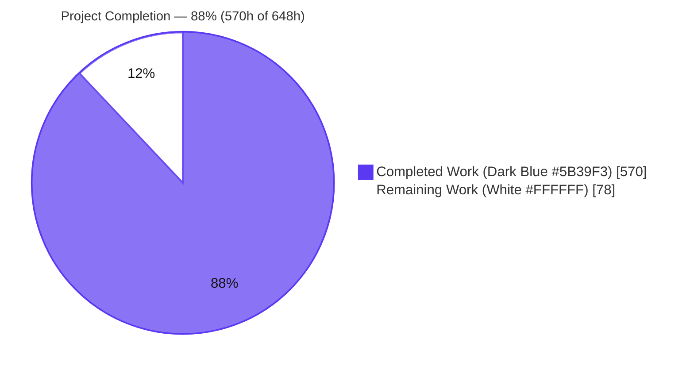
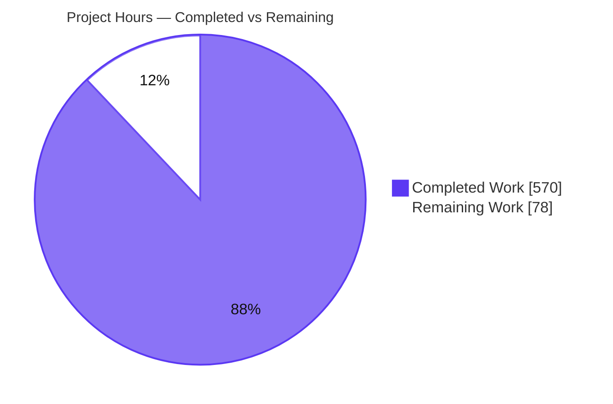
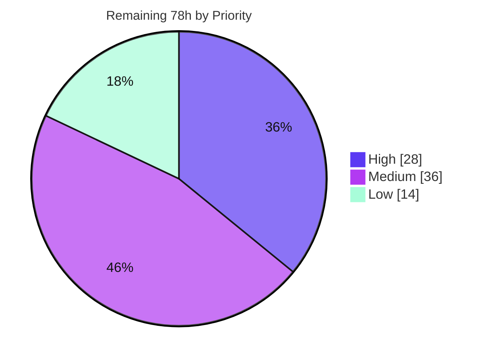

# Blitzy Project Guide
### DotNetNuke 4.9.0.85 → .NET 8 + Angular 19 Migration

> Brand legend used throughout: **Completed / AI Work = Dark Blue `#5B39F3`** · **Remaining / Not Completed = White `#FFFFFF`** · Headings/Accents = Violet-Black `#B23AF2` · Highlight = Mint `#A8FDD9`.

---

## 1. Executive Summary

### 1.1 Project Overview
This project is a complete ground-up rewrite (tech-stack migration) of the legacy **DotNetNuke (DNN) 4.9.0.85** portal framework — originally VB.NET / ASP.NET Web Forms on .NET Framework 2.0 — into two modern, independently deployable applications: an **ASP.NET Core 8 Web API** (C# 12, Clean Architecture, Backend-for-Frontend) and an **Angular 19 standalone SPA**, packaged as a **two-container Docker Compose** topology for Linux. It targets platform/operations teams maintaining DNN portals, preserving domain semantics and functional parity for the Portal, Module, User, Role, and Tab subsystems while modernizing data access (EF Core 8) and security (JWT Bearer + BCrypt).

### 1.2 Completion Status


```mermaid
%%{init: {'theme':'base', 'themeVariables': {'pie1':'#5B39F3','pie2':'#FFFFFF','pieStroke':'#5B39F3','pieStrokeColor':'#5B39F3','pieStrokeWidth':'2px','pieOuterStrokeColor':'#5B39F3','pieOuterStrokeWidth':'2px','pieSectionTextColor':'#111111','pieTitleTextSize':'16px'}}}%%
pie showData title Project Completion — 88% (570h of 648h)
    "Completed Work (Dark Blue #5B39F3)" : 570
    "Remaining Work (White #FFFFFF)" : 78
```

**Completion formula (PA1, AAP-scoped):** `570 ÷ 648 = 87.96% ≈ 88.0% complete`.

| Metric | Hours |
|---|---|
| **Total Hours** | **648** |
| **Completed Hours (AI + Manual)** | **570** (AI autonomous: 570 · Manual: 0) |
| **Remaining Hours** | **78** |
| **Percent Complete** | **88.0%** |

> All 570 completed hours were delivered autonomously by Blitzy agents (445 commits, 336 files created). The Final Validator required **zero in-scope code changes**. The 78 remaining hours are exclusively path-to-production activities (see §2.2).

### 1.3 Key Accomplishments
- ✅ **Backend (.NET 8) fully implemented & compiles clean** — `dotnet build -c Release --warnaserror` → **0 errors / 0 warnings** across all 6 projects (CS8618 exempt per policy).
- ✅ **All 5 runnable validation gates pass** — independently re-executed during this assessment.
- ✅ **752/752 automated tests passing** — 371 backend unit + 64 backend integration + 317 frontend unit.
- ✅ **Clean Architecture delivered** — Domain (16 entities, 3 verbatim enums, 5 repo interfaces), Application (6 services, 21 DTOs, 6 AutoMapper profiles, 10 validators), Infrastructure (DnnDbContext + 8 EF Fluent configs, 5 repositories, JWT/BCrypt identity), API (7 controllers, RFC 7807 middleware, composition root).
- ✅ **Angular 19 SPA delivered** — 13 standalone feature components, lazy-loaded routes (production build emits per-feature chunks), auth interceptor/guard, shared primitives + `has-permission` RBAC directive.
- ✅ **Sanctioned security upgrade complete** — Forms Auth + DES → JWT Bearer + BCrypt with refresh-token rotation, rate-limited auth endpoints, origin-restricted CORS, JWT key fail-fast.
- ✅ **API runtime proven** — published API boots in Production and `curl /health` → **HTTP 200** `{"status":"Healthy"}`; Serilog structured logging active.
- ✅ **SPA runtime proven** — served production bundle bootstraps, auth guard redirects to `/auth/login`, login renders with **zero console errors**.
- ✅ **Comprehensive documentation** — `README.md` (380 lines) + `MIGRATION_NOTES.md` (1,246 lines) recording every deviation per the Minimal Change Clause.

### 1.4 Critical Unresolved Issues
There are **no in-scope code defects**. The items below are path-to-production verifications that could not run autonomously on a Docker-less Windows host without a live database.

| Issue | Impact | Owner | ETA |
|---|---|---|---|
| EF Core schema fidelity verified only vs EF **InMemory**, not real SQL Server | ADR-002 unchanged-schema contract unproven against live DNN 4.9.0.85 DB | Backend / DBA | 16h |
| Docker Gates 6 & 7 not executed (no Docker daemon on host) | Container build/run + nginx `/api` proxy unproven end-to-end | DevOps | 8h |
| Production secrets not provisioned | API cannot serve authenticated traffic until `Jwt__Key` (≥32B) + `ConnectionStrings__Default` set | DevOps | 4h |
| Legacy DES passwords incompatible with one-way BCrypt | Existing DNN users cannot authenticate until a rehash/reset strategy is implemented | Security / Backend | (within 8h security task) |

### 1.5 Access Issues

| System/Resource | Type of Access | Issue Description | Resolution Status | Owner |
|---|---|---|---|---|
| Docker daemon | Build/runtime environment | Validation host is a Windows Server 2022 container with no Docker daemon; cannot build/run Linux alpine images (Gates 6/7) | Open — requires a Linux Docker host | DevOps |
| SQL Server + DNN 4.9.0.85 DB | Database access | No real database available to validate EF Core mappings or run integration tests against live SQL Server | Open — provision DB / restore backup | DBA |
| Production secrets (`Jwt__Key`, `ConnectionStrings__Default`) | Credentials | Not provisioned (by design — no insecure defaults; `${VAR:?}` + fail-fast enforced) | Open — inject via secret manager | DevOps |
| Source repository | Repository permissions | Full read/write access confirmed; branch up to date with origin | ✅ No issue | — |

### 1.6 Recommended Next Steps
1. **[High]** Provision SQL Server, connect a real DNN 4.9.0.85 database, and verify the 8 EF Fluent configurations against the live schema; re-run the 64 integration tests on real SQL Server (16h).
2. **[High]** Execute Gates 6 & 7 on a Linux Docker host (`docker-compose build` then `up -d`); verify API `:8080/health`, SPA `:4200`, and nginx `/api/*` proxy end-to-end (8h).
3. **[High]** Configure production secrets & environment — `Jwt__Key` (≥32 bytes), `ConnectionStrings__Default`, CORS origin, HTTPS/TLS (4h).
4. **[Medium]** Stand up a CI/CD pipeline (build → all 7 gates → containerize → deploy) and run a full-stack E2E smoke test (22h combined).
5. **[Medium]** Complete security sign-off including the **DES→BCrypt password-migration strategy** (rehash-on-first-login or forced reset) for existing users (8h).

---

## 2. Project Hours Breakdown

### 2.1 Completed Work Detail
*Each component traces to a specific AAP deliverable. Total = **570h** = Completed Hours in §1.2.*

| Component | Hours | Description |
|---|---:|---|
| Domain layer | 30 | 16 POCO entities (from `*Info.vb`), 3 verbatim enums (UserCreateStatus/UserLoginStatus/VisibilityState), 5 repository interfaces |
| Application services | 58 | 6 services porting `*Controller.vb` + `PortalSecurity.vb` business logic (Portal/Module/User/Role/Tab/Auth), async, repository-backed |
| Application DTOs / mapping / validation | 40 | 21 DTOs (X/Create/Update), 6 AutoMapper profiles, 10 FluentValidation validators, Common envelope (ApiResponse/PagedResult) |
| Infrastructure — persistence | 44 | DnnDbContext + 8 EF Core Fluent configurations (schema mapped unchanged, ADR-002) + 5 EF repositories (`AsNoTracking` reads) |
| Infrastructure — identity | 22 | JwtService (issue/validate/rotate), PasswordHasher (BCrypt), JwtSettings, refresh-token store — the sanctioned Forms Auth+DES → JWT+BCrypt change |
| API layer | 40 | 7 controllers (`/api/v1/*` + `/api/auth` + `/health`), RFC 7807 ExceptionHandlingMiddleware, Program.cs (DI/JWT/CORS/Swagger/Serilog/rate-limiting), appsettings |
| Backend tests | 70 | 371 xUnit unit tests + 64 integration tests (Mvc.Testing + EF InMemory) |
| Frontend — feature components | 78 | 13 standalone components: login + portal/module/user/role CRUD screens, with templates, SCSS, typed reactive forms |
| Frontend — core | 24 | api.service, auth.service/guard/interceptor (Bearer + 401 refresh), unsaved-changes guard, models |
| Frontend — shared | 28 | data-table, form-controls, confirmation-dialog, loading-spinner, icon, date-format pipe, autofocus/has-permission/tooltip/validation-highlight directives |
| Frontend — layout + SPA scaffolding | 24 | header/sidebar/footer chrome, app.component/config/routes, 6 lazy route tables, environments, angular.json/tsconfig/package.json |
| Frontend tests | 40 | 317 Karma/Jasmine component specs |
| Docker configuration authoring | 14 | api.Dockerfile, frontend.Dockerfile, nginx.conf, docker-compose.yml, .env.example, .dockerignore (statically validated & cross-consistent) |
| Documentation | 18 | README.md (380 lines), MIGRATION_NOTES.md (1,246 lines) — Minimal Change Clause deviation log |
| Solution / build scaffolding | 10 | DnnMigration.sln, 6 .csproj, Directory.Build.props, global.json |
| Validation & QA hardening | 30 | 445 commits incl. QA checkpoints (F1–F15 etc.), gate validation, code-review remediation |
| **Total Completed** | **570** | |

### 2.2 Remaining Work Detail
*Each category traces to an AAP / path-to-production need. Total = **78h** = Remaining Hours in §1.2 = §7 pie "Remaining Work".*

| Category | Hours | Priority |
|---|---:|---|
| Provision SQL Server + verify EF schema fidelity vs live DNN 4.9.0.85 DB + run integration suite on real SQL Server | 16 | High |
| Gate 7 — `docker-compose up -d` + verify API `:8080/health`, SPA `:4200`, nginx `/api` proxy E2E (Linux host) | 5 | High |
| Gate 6 — `docker-compose build` on a Linux Docker host (both images) | 3 | High |
| Configure production secrets & environment (`Jwt__Key`≥32B, `ConnectionStrings__Default`, CORS, HTTPS) | 4 | High |
| End-to-end functional smoke test of full stack (login→JWT→CRUD across 5 aggregates via SPA) | 10 | Medium |
| CI/CD pipeline setup (build → test → containerize → deploy) | 12 | Medium |
| Security review & hardening sign-off (incl. DES→BCrypt password migration, auth pen-test, rate-limit tuning, secrets manager, dependency re-scan) | 8 | Medium |
| Production observability wiring (centralized Serilog sinks, health dashboards, alerting) | 6 | Medium |
| UAT / functional-parity sign-off vs legacy DNN admin workflows | 8 | Low |
| Performance/load testing & tuning (CDK virtual scroll, EF query profiling, OnPush under load; evaluate Redis-backed refresh-token store) | 6 | Low |
| **Total Remaining** | **78** | |

### 2.3 Hours Reconciliation
- Section 2.1 (Completed) = **570h** · Section 2.2 (Remaining) = **78h** · **570 + 78 = 648h** (Total, §1.2). ✅
- Remaining hours **78h** identical across §1.2, §2.2, and §7. ✅
- Completion = `570 ÷ 648 = 87.96% ≈ 88.0%`. ✅

---

## 3. Test Results
*All tests originate from Blitzy's autonomous validation logs and were independently re-executed during this assessment.*

| Test Category | Framework | Total Tests | Passed | Failed | Coverage % | Notes |
|---|---|---:|---:|---:|---|---|
| Backend Unit | xUnit + Moq + FluentAssertions | 371 | 371 | 0 | Not formally reported | `dotnet test -c Release` → exit 0, 0 skipped |
| Backend Integration | xUnit + Mvc.Testing + EF Core InMemory | 64 | 64 | 0 | Not formally reported | `--filter Category=Integration`; Portal/Module/User CRUD verbs (POST 201, GET 200, PUT 200, DELETE 204) |
| Frontend Unit | Karma + Jasmine (ChromeHeadless) | 317 | 317 | 0 | karma-coverage instrumented; threshold not reported | `ng test --watch=false --browsers=ChromeHeadless` → TOTAL 317 SUCCESS |
| **TOTAL** | — | **752** | **752** | **0** | — | **100% pass rate** |

> **Coverage note:** Numeric coverage thresholds were not captured in the autonomous validation logs; backend has no coverage gate and the frontend uses `karma-coverage` instrumentation without a reported percentage. No coverage figures are invented here. Confirming/raising coverage is a recommended (non-blocking) follow-up.

---

## 4. Runtime Validation & UI Verification

**Backend runtime**
- ✅ **Operational** — API boots in `Production`; `curl /health` → **HTTP 200** `{"status":"Healthy"}`.
- ✅ **Operational** — Serilog structured logging active; JWT key fail-fast confirmed (key < 32 bytes → immediate startup abort).
- ✅ **Operational** — Release build clean (0 errors / 0 warnings); 371 unit + 64 integration tests pass.

**Frontend runtime / UI**
- ✅ **Operational** — Production bundle (`dist/dnn-migration/browser`) bootstraps Angular; served via a static host and loaded in Chrome.
- ✅ **Operational** — Auth guard redirects unauthenticated user `/` → `/auth/login?returnUrl=%2Fportals`.
- ✅ **Operational** — Login standalone component renders (Username/Password reactive form, focused username via `autofocus` directive, "Sign in" button, footer); **zero console errors/warnings**. *(Evidence: `blitzy/screenshots/spa_login_production_build.png`.)*
- ✅ **Operational** — Production build emits per-feature lazy chunks (portal/module/user/role components), confirming `loadComponent` routing.

**API integration / data**
- ✅ **Operational (InMemory)** — 64 integration tests exercise CRUD across Portal/Module/User via EF Core InMemory with correct REST status codes.
- ⚠ **Partial** — Real SQL Server / live DNN schema not yet exercised (InMemory only).
- ⚠ **Partial** — Full SPA↔API↔DB E2E and nginx `/api` reverse-proxy path not yet exercised (requires Linux Docker host + DB).

**Containerization**
- ⚠ **Partial** — `docker-compose build` / `up` not executed (no Docker daemon on host); all 4 configs statically validated and cross-consistent; API `/health` proven locally as the core Gate 7 assertion.

---

## 5. Compliance & Quality Review
*Cross-mapping AAP deliverables and rules to delivered evidence.*

| AAP Requirement / Rule | Benchmark | Status | Evidence / Notes |
|---|---|---|---|
| Idiomatic C# 12 / .NET 8 LTS, nullable enabled, warnings-as-errors | Gate 1 | ✅ Pass | Directory.Build.props enforces net8.0/C#12/Nullable/TreatWarningsAsErrors (CS8618 exempt); 0W/0E build |
| Clean Architecture (Api→App→Domain; Infra→Domain) | Design | ✅ Pass | 4 src projects + 2 test projects; Domain has zero framework deps |
| EF Core 8 maps existing schema unchanged (ADR-002) | Schema fidelity | ◑ Partial | 8 Fluent configs authored; **live-DB verification pending** (InMemory only) |
| Preserve domain semantics & verbatim enum values | Parity | ✅ Pass | 16 entities + 3 enums ported; values retained per AAP |
| Forms Auth + DES → JWT Bearer + BCrypt (sole sanctioned change) | Security upgrade | ✅ Pass | JwtService + BCrypt PasswordHasher; refresh rotation; `// MIGRATION:` annotations |
| API standards: `{data,meta}` envelope, RFC 7807 errors, `/api/v1/` versioning, origin-restricted CORS, auth rate-limiting | API contract | ✅ Pass | ApiResponse/PagedResult; ExceptionHandlingMiddleware; versioned routes; CORS "AngularSpa"; `[EnableRateLimiting("auth")]` |
| Angular 19 standalone, signals, lazy loading, OnPush, a11y | Frontend design | ✅ Pass | strictStandalone; lazy chunks; reactive forms; ARIA in templates |
| Minimal Change Clause — document deviations | Governance | ✅ Pass | MIGRATION_NOTES.md (1,246 lines); e.g. D-034/D-041 document the ADR-002-bound membership scope reduction |
| Functional parity (UI workflows + validation/error semantics) | Parity | ◑ Partial | Component specs pass; **UAT vs legacy pending** |
| Containerize for Linux (two-container Compose) | Deployment | ◑ Partial | Configs correct; **build/run on Linux pending** |
| All automated tests pass | Gates 2/4/5 | ✅ Pass | 752/752 |

**Fixes applied during autonomous validation:** None required by the Final Validator (code compiled, tested, and ran cleanly on first validation). Quality hardening across the 445-commit history addressed QA checkpoints (e.g., validation styling, nginx security headers, info-exposure, docs accuracy F1–F15).

---

## 6. Risk Assessment

| Risk | Category | Severity | Probability | Mitigation | Status |
|---|---|---|---|---|---|
| EF schema fidelity verified only vs InMemory, not real SQL Server (ADR-002 unproven against live DB) | Technical | High | Medium | Run integration suite vs SQL Server restored from a real DNN backup; reconcile Fluent configs | Open (16h) |
| Behavioral equivalence not differentially tested vs running legacy DNN | Technical | Medium | Medium | UAT vs legacy admin workflows; spot-check identical inputs | Open (8h) |
| CS8618 nullable warnings exempted on entities/DTOs | Technical | Low | Low | FluentValidation guards all command DTOs; add targeted null checks if observed | Mitigated |
| Production secrets not yet provisioned (no secret-manager wiring; no insecure defaults) | Security | High | Medium | Inject `Jwt__Key`/DB creds via Key Vault/secret store; rotate | Open (4h); partially mitigated by fail-fast + `${VAR:?}` |
| Legacy DES passwords incompatible with one-way BCrypt | Security | High | High (if onboarding existing users) | Rehash-on-first-login or forced reset; documented in MIGRATION_NOTES | Open (within 8h security task) |
| Refresh-token store is in-memory (ConcurrentDictionary) | Security | Medium | High at scale | Substitute Redis/DB-backed `IRefreshTokenStore` (interface already abstracts it) | Known/Documented |
| Auth pipeline (JWT/rate-limit/CORS/CSP/HTTPS) not pen-tested nor validated through nginx+TLS | Security | Medium | Medium | Security review + E2E auth testing | Open (8h) |
| Docker images never built/run on Linux (Gates 6/7) | Operational | Medium | Low-Medium | Execute Gates 6/7 on Linux Docker host | Open (8h); static-validated + local /health 200 |
| No CI/CD pipeline | Operational | Medium | Medium | Add build→test→containerize→deploy automation | Open (12h) |
| Observability limited to Serilog stdout | Operational | Medium | Medium | Wire centralized aggregation + dashboards + alerts | Open (6h) |
| Full SPA↔API↔DB stack never exercised E2E | Integration | High | Medium | E2E smoke after compose-up on Linux with real DB | Open (15h across Gate 7 + E2E) |
| nginx `/api` reverse proxy + SPA fallback + CSP unvalidated with real frontend↔API | Integration | Medium | Low-Medium | Validate during Gate 7 compose run | Open (part of Gate 7) |
| Real DB connectivity (conn string, network, SQL version, TLS) unverified | Integration | Medium | Medium | Provision DB; verify connection; run integration on real SQL Server | Open (part of 16h DB item) |

**Overall posture:** No in-scope code defects. All risks are deployment/verification/scale concerns typical of a pre-first-deploy migration; several (in-memory refresh store, DES→BCrypt) are already acknowledged and documented in `MIGRATION_NOTES.md`.

---

## 7. Visual Project Status

### Project Hours Breakdown

```mermaid
%%{init: {'theme':'base', 'themeVariables': {'pie1':'#5B39F3','pie2':'#FFFFFF','pieStroke':'#5B39F3','pieStrokeColor':'#5B39F3','pieStrokeWidth':'2px','pieOuterStrokeColor':'#5B39F3','pieOuterStrokeWidth':'2px','pieSectionTextColor':'#111111','pieTitleTextSize':'16px'}}}%%
pie showData title Project Hours — Completed vs Remaining
    "Completed Work" : 570
    "Remaining Work" : 78
```
*Completed = Dark Blue `#5B39F3` · Remaining = White `#FFFFFF`. "Remaining Work" = 78h = §1.2 Remaining = §2.2 total.*

### Remaining Hours by Priority

```mermaid
%%{init: {'theme':'base', 'themeVariables': {'pie1':'#5B39F3','pie2':'#B23AF2','pie3':'#A8FDD9','pieSectionTextColor':'#111111','pieTitleTextSize':'16px'}}}%%
pie showData title Remaining 78h by Priority
    "High" : 28
    "Medium" : 36
    "Low" : 14
```

### Remaining Hours by Category (bar)
| Category | Hours | Bar |
|---|---:|---|
| Real SQL Server + schema verification | 16 | ████████████████ |
| CI/CD pipeline | 12 | ████████████ |
| E2E functional smoke test | 10 | ██████████ |
| Security review & hardening | 8 | ████████ |
| UAT / parity sign-off | 8 | ████████ |
| Observability wiring | 6 | ██████ |
| Performance/load testing | 6 | ██████ |
| Gate 7 compose up + E2E proxy | 5 | █████ |
| Production secrets/env | 4 | ████ |
| Gate 6 docker build | 3 | ███ |
| **Total** | **78** | |

---

## 8. Summary & Recommendations

**Achievements.** The migration is **88% complete (570h of 648h)**. The entire in-scope codebase — a four-project Clean Architecture .NET 8 backend, an Angular 19 standalone SPA, six EF-mapped aggregates with full vertical slices, the sanctioned JWT+BCrypt security upgrade, and a two-container Docker topology — has been delivered and independently verified. **All five runnable validation gates pass and 752/752 automated tests are green.** The API boots in Production with a healthy `/health` endpoint, and the production SPA bundle loads in a browser with correct auth-guard routing and zero console errors.

**Remaining gaps (78h, all path-to-production).** No in-scope code work remains. The outstanding work is deployment and verification that cannot be performed autonomously on a Docker-less Windows host without a live database: (1) verifying EF Core schema fidelity against a real DNN 4.9.0.85 SQL Server (the central ADR-002 contract, currently proven only via EF InMemory); (2) executing Docker Gates 6/7 on a Linux host and validating the nginx `/api` proxy end-to-end; (3) provisioning production secrets; (4) CI/CD, full-stack E2E/UAT, observability, and a security sign-off that must include a DES→BCrypt password-migration strategy for existing users.

**Critical path to production.** Real-DB schema verification → secrets configuration → Docker Gates 6/7 on Linux → full-stack E2E smoke → security & UAT sign-off.

**Success metrics.** Build 0W/0E ✅ · 752/752 tests ✅ · API `/health` 200 ✅ · SPA bootstrap + 0 console errors ✅ · Docker build/run on Linux ⏳ · real-DB integration ⏳.

**Production readiness assessment.** **Code-complete and validation-green; not yet production-deployed.** The work product is high quality with documented deviations and no known in-scope defects. With the focused **78h** of path-to-production effort — front-loaded on real-DB verification and Docker execution — the system is positioned for a confident first deployment.

---

## 9. Development Guide

### 9.1 System Prerequisites
- **.NET SDK 8.0.4xx** (repo pins `8.0.421` via `backend/global.json`, `rollForward: latestFeature`)
- **Node.js 20 LTS** (validated on v20.20.2) and **npm 10.x**
- **Google Chrome** (for `ng test --browsers=ChromeHeadless`)
- **Docker + Docker Compose on a Linux host** (for Gates 6/7 only — not runnable on Windows containers)
- **SQL Server** with the existing DNN `4.9.0.85` schema (runtime only; tests use EF InMemory)

### 9.2 Backend — build, test, run
```bash
cd backend

# 1) Restore dependencies (19 NuGet packages)
dotnet restore DnnMigration.sln                       # → exit 0

# 2) Gate 1 — Release build, warnings-as-errors
dotnet build DnnMigration.sln -c Release --warnaserror # → 0 errors / 0 warnings

# 3) Gate 2 — unit tests + Gate 5 — integration tests
dotnet test DnnMigration.sln -c Release --no-build     # → 371 unit + 64 integration pass
dotnet test --filter Category=Integration              # → 64 pass

# 4) Run the API (runtime needs a ≥32-byte JWT key + a connection string;
#    /health needs neither)
export ASPNETCORE_ENVIRONMENT=Development
export Jwt__Key="replace-with-a-real-randomly-generated-key-of-at-least-32-bytes"
export ConnectionStrings__Default="Server=localhost,1433;Database=DotNetNuke;User Id=USER;Password=PASS;TrustServerCertificate=True;MultipleActiveResultSets=True"
dotnet run --project src/DnnMigration.Api -c Release
```
> Windows PowerShell equivalents: `$env:Jwt__Key="..."` etc. To pin the port: `$env:ASPNETCORE_URLS="http://127.0.0.1:5199"`.

**Verify the API**
```bash
curl -f http://localhost:5199/health        # → HTTP 200 {"status":"Healthy", ...}
# Swagger UI (Development only):  http://localhost:5199/swagger
```

### 9.3 Frontend — build, test, run
```bash
cd frontend

npm ci                                       # install from package-lock.json
npx ng build --configuration production      # Gate 3 → dist/dnn-migration/browser

# Gate 4 — unit tests (set CHROME_BIN on headless hosts)
export CHROME_BIN="$(which google-chrome || echo /usr/bin/chromium)"   # Windows: $env:CHROME_BIN="C:\Program Files\Google\Chrome\Application\chrome.exe"
npx ng test --watch=false --browsers=ChromeHeadless   # → TOTAL 317 SUCCESS

# Dev server (proxies to the API origin set in src/environments/environment.ts)
npx ng serve                                 # → http://localhost:4200
```

### 9.4 Docker (Gates 6 & 7 — Linux host only)
```bash
cd docker
cp .env.example .env
# Edit .env: set REAL ConnectionStrings__Default and a ≥32-byte Jwt__Key
docker-compose build                         # Gate 6 → both images build
docker-compose up -d                         # Gate 7
curl -f http://localhost:8080/health         # API → 200
curl -f http://localhost:4200/               # SPA  → 200 (nginx proxies /api → api:8080)
docker-compose down
```

### 9.5 Example Usage
```bash
# Authenticate (returns JWT access + refresh)
curl -X POST http://localhost:5199/api/auth/login \
  -H "Content-Type: application/json" \
  -d '{"username":"admin","password":"<password>"}'

# Use the token against a versioned resource
curl http://localhost:5199/api/v1/portals \
  -H "Authorization: Bearer <accessToken>"
```

### 9.6 Troubleshooting
- **API exits immediately at startup** → `Jwt__Key` is missing or < 32 bytes. Set a ≥32-byte key (fail-fast by design).
- **`Failed to determine the https port for redirect` (WRN)** → benign for plain-HTTP `/health`; ignore in dev/health probing.
- **`ng test` cannot find a browser** → set `CHROME_BIN` to the Chrome/Chromium executable.
- **`docker-compose` fails on Windows** → expected; requires a Linux Docker host (no daemon on Windows-container hosts).
- **DB/EF errors at runtime** → ensure a reachable SQL Server with the DNN 4.9.0.85 schema and a correct `ConnectionStrings__Default`. (Automated tests use EF InMemory and pass without a DB.)
- **CORS errors in the browser** → confirm the SPA origin is listed in `Cors:AllowedOrigins` (default `http://localhost:4200`).

---

## 10. Appendices

### A. Command Reference
| Purpose | Command |
|---|---|
| Restore backend | `dotnet restore DnnMigration.sln` |
| Build (Gate 1) | `dotnet build DnnMigration.sln -c Release --warnaserror` |
| Unit tests (Gate 2) | `dotnet test DnnMigration.sln -c Release` |
| Integration tests (Gate 5) | `dotnet test --filter Category=Integration` |
| Run API | `dotnet run --project src/DnnMigration.Api -c Release` |
| Frontend install | `npm ci` |
| Frontend build (Gate 3) | `npx ng build --configuration production` |
| Frontend tests (Gate 4) | `npx ng test --watch=false --browsers=ChromeHeadless` |
| Docker build (Gate 6) | `docker-compose build` |
| Docker up (Gate 7) | `docker-compose up -d` |

### B. Port Reference
| Service | Port | Notes |
|---|---|---|
| API (container / compose) | 8080 | `ASPNETCORE_URLS=http://+:8080`; healthcheck `/health` |
| API (local dev) | 5xxx (e.g. 5199) | Kestrel default or via `ASPNETCORE_URLS` |
| Frontend (dev `ng serve`) | 4200 | — |
| Frontend (container) | 8080 (host 4200) | Unprivileged nginx listens on 8080; compose maps `4200:8080` |
| SQL Server | 1433 | Existing DNN 4.9.0.85 database |

### C. Key File Locations
| Item | Path |
|---|---|
| Backend solution | `backend/DnnMigration.sln` |
| SDK pin / build policy | `backend/global.json`, `backend/Directory.Build.props` |
| Composition root | `backend/src/DnnMigration.Api/Program.cs` |
| API config | `backend/src/DnnMigration.Api/appsettings.json` (+ `.Development.json`) |
| EF DbContext | `backend/src/DnnMigration.Infrastructure/Persistence/DnnDbContext.cs` |
| SPA routes | `frontend/src/app/app.routes.ts` |
| SPA workspace | `frontend/package.json`, `frontend/angular.json` |
| Docker | `docker/docker-compose.yml`, `api.Dockerfile`, `frontend.Dockerfile`, `nginx.conf`, `.env.example` |
| Docs | `README.md`, `MIGRATION_NOTES.md` |
| UI evidence | `blitzy/screenshots/spa_login_production_build.png` |

### D. Technology Versions
| Component | Version |
|---|---|
| .NET SDK | 8.0.421 (net8.0, C# 12) |
| EF Core (+ SqlServer/Design/Tools) | 8.0.11 |
| ASP.NET Auth JwtBearer / OpenApi | 8.0.11 |
| Swashbuckle.AspNetCore | 6.9.0 |
| AutoMapper.Extensions.Microsoft.DI | 12.0.1 |
| FluentValidation.AspNetCore | 11.3.0 |
| Serilog.AspNetCore / Sinks.Console | 8.0.3 / 6.0.0 |
| BCrypt.Net-Next | 4.0.3 |
| xUnit / Moq / FluentAssertions | 2.9.2 / 4.20.72 / 6.12.2 |
| Mvc.Testing / EFCore.InMemory | 8.0.11 / 8.0.11 |
| Node.js / npm | 20.20.2 / 10.8.2 |
| Angular / CLI | 19.2.x (^19.0.0) / 19.2.27 |
| TypeScript / RxJS / zone.js | 5.6+ (resolved 5.8.3) / 7.8.1 / 0.15.x |
| Karma / Jasmine | 6.4.4 / 5.x |

### E. Environment Variable Reference
| Variable | Required | Purpose |
|---|---|---|
| `ConnectionStrings__Default` | Yes (runtime) | SQL Server connection to DNN 4.9.0.85 DB (double underscore = nested config) |
| `Jwt__Key` | Yes (runtime) | JWT signing key — **≥ 32 bytes**; API fail-fasts otherwise |
| `ASPNETCORE_ENVIRONMENT` | No | `Production` / `Development` (Swagger UI is Development-only) |
| `ASPNETCORE_URLS` | No | Bind address/port (e.g. `http://+:8080`) |
| `CHROME_BIN` | No (test) | Chrome/Chromium path for `ng test` on headless hosts |
| `Cors__AllowedOrigins__0` | No | Override allowed SPA origin (default `http://localhost:4200`) |

### F. Developer Tools Guide
- **Swagger / OpenAPI** — `http://<api>/swagger` (Development only); JWT Bearer is wired into the UI to exercise protected endpoints. CSP is exempted for `/swagger` paths.
- **Health check** — `GET /health` (anonymous, unversioned) returns `{"status":"Healthy", "timestamp": ...}`.
- **Structured logs** — Serilog writes to console/stdout with `FromLogContext` enrichment; request logging via `UseSerilogRequestLogging`.
- **Rate limiting** — auth endpoints opt in via `[EnableRateLimiting("auth")]`.

### G. Glossary
| Term | Meaning |
|---|---|
| **AAP** | Agent Action Plan — the authoritative migration requirements document |
| **ADR-002** | Architectural decision mandating the existing DNN schema be mapped **unchanged** (no EF migrations, no data migration in Phase 1) |
| **BFF** | Backend-for-Frontend — API tailored to the Angular client (envelope, versioning, CORS) |
| **CBO** | Legacy DNN reflection-based object hydration, replaced by EF Core materialization |
| **Minimal Change Clause** | Rule requiring domain logic to be preserved as-is and every deviation/ported bug documented in `MIGRATION_NOTES.md` |
| **RFC 7807** | Problem Details standard used for API error responses |
| **Gate 1–7** | The seven AAP validation gates (build, unit/integration tests, Angular build/tests, container build/startup) |
