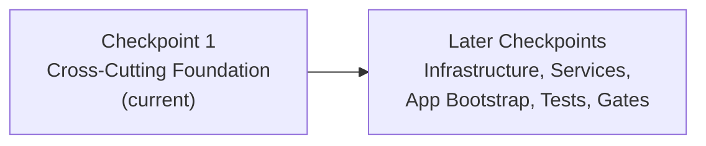

# DnnMigration Project Assessment Guide

## Executive Summary

**Status: Checkpoint 1 — Cross-Cutting Foundation (in progress; not production-ready)**

This guide covers the DotNetNuke 4.x → .NET 8 + Angular 19 migration. At this checkpoint the project has established the **cross-cutting foundation**: the backend Domain layer (with a buildable project), an initial set of Application-layer DTOs and interfaces, API scaffolding (a base controller and the Health controller), the Angular frontend foundation (core models, shared components/directives/pipes, an initial feature component, and layout), and the Docker/nginx deployment manifests. It is **not** production-ready: the full solution does not yet build end-to-end, the automated test suites and validation gates have **not** yet been executed, and no container image or runtime health check has been produced at this checkpoint.

> **Note on scope:** The figures and workflows in this guide describe the **target end-state** architecture and the intended build/test/run process. Any section that reports build, test, container, or runtime results describes validation gates that are **deferred** to later checkpoints — they are forward-looking targets, not claims that those gates have already passed.

### Key Metrics
| Metric | Value |
|--------|-------|
| Checkpoint | 1 — Cross-Cutting Foundation |
| Backend Domain project | Present; builds under `dotnet build --warnaserror` (0 errors / 0 warnings) |
| Backend Application / API | Foundation source files present (DTOs, interfaces, API base + Health controller); full solution/project wiring lands in a later checkpoint |
| Backend Infrastructure | Not yet present (EF Core `DnnDbContext`, repositories, and Fluent configurations are planned for a later checkpoint) |
| Frontend foundation | Core models, shared components/directives/pipes, an initial feature component, layout, and `package.json` present; app bootstrap (`main.ts` / `angular.json`) lands in a later checkpoint |
| Docker manifests | Present (`api.Dockerfile`, `frontend.Dockerfile`, `docker-compose.yml`, `nginx.conf`) |
| Automated tests | Not yet executed at this checkpoint (test projects and gates deferred) |
| Build / container / runtime gates | Deferred to later checkpoints (see Validation Results Summary) |

### Checkpoint Scope

This checkpoint delivers the cross-cutting **foundation** that later checkpoints build on. It intentionally does **not** attempt the full migration; the remaining work is tracked in the Human Task List and future checkpoints.

**Delivered at this checkpoint**
- Backend **Domain** layer with a buildable `DnnMigration.Domain` project (entities, enums, repository interface)
- Initial backend **Application** artifacts (DTOs and interfaces) and **API** scaffolding (base controller, Health controller, base `appsettings.json`)
- Angular **frontend foundation** — `core` models, `shared` components/directives/pipes, an initial `features` component, and `layout`
- **Docker** deployment manifests and the hardened **nginx** configuration

**Planned for later checkpoints**
- Backend **Infrastructure** (EF Core `DnnDbContext`, repositories, Fluent mappings to the existing DNN schema), the remaining Application services, and full solution/project wiring
- Backend and frontend **test projects** and execution of all validation gates
- Angular **application bootstrap** (`main.ts`, `angular.json`, routing) and feature build-out
- Environment configuration, database deployment, CI/CD, monitoring, security hardening, and performance testing

---

## Checkpoint Progression



This guide reflects the state at **Checkpoint 1**. Build, test, container, and runtime results referenced below are validation gates that execute in later checkpoints.

---

## Validation Results Summary

The migration defines seven validation gates (see the technical specification). At **Checkpoint 1** these gates are **not yet executed** — they are the exit criteria for later checkpoints, once the full solution, the Angular application bootstrap, and the test projects are in place.

### Validation Gate Status
| Gate | Description | Status at Checkpoint 1 |
|------|-------------|------------------------|
| 1 | API compiles (`dotnet build -c Release --warnaserror`, 0/0) | Deferred — only `DnnMigration.Domain` exists and builds clean under `--warnaserror`; the full solution is not yet wired |
| 2 | API unit tests pass | Deferred — backend unit test project not yet present |
| 3 | Angular production build (`ng build`) | Deferred — app bootstrap (`main.ts` / `angular.json`) not yet present |
| 4 | Angular unit tests pass | Deferred — frontend test setup not yet present |
| 5 | API integration tests (Portal/Module/User CRUD) | Deferred — integration test project not yet present |
| 6 | Container build (`docker-compose build`) | Deferred — runs in a Linux/Docker CI environment |
| 7 | Container startup health checks (`/health`, `/`) | Deferred — depends on Gate 6 |

### Foundation Checks Performed at This Checkpoint
- `DnnMigration.Domain` compiles under `dotnet build -c Release --warnaserror` with **0 errors / 0 warnings**.
- The Angular foundation global stylesheet and component styles are syntactically valid (compiled with `sass`).
- The `nginx.conf` structure and security headers were reviewed (server hardening + Content-Security-Policy).

> Runtime validation of the `/health` endpoint (expected `{"status":"Healthy","version":"1.0.0.0"}`) occurs once the API host and full solution build are completed in a later checkpoint.

---

## Comprehensive Development Guide

### System Prerequisites

| Requirement | Version | Purpose |
|-------------|---------|---------|
| .NET SDK | 8.0 LTS | Backend development and build |
| Node.js | 20.x LTS | Frontend development and build |
| npm | 10.x | Package management |
| Docker | 24.x+ | Container builds |
| Docker Compose | 2.x | Multi-container orchestration |
| SQL Server | 2019+ | Database (or use containerized) |

### Environment Setup

#### 1. Clone Repository
```bash
git clone <repository-url>
cd DnnMigration
git checkout blitzy-66f1edb5-b17c-4fb9-84f5-7cf92b248f5d
```

#### 2. Backend Setup
```bash
# Navigate to backend directory
cd backend

# Restore NuGet packages
dotnet restore DnnMigration.sln

# Build solution (Release mode with warnings as errors)
dotnet build DnnMigration.sln --configuration Release --warnaserror

# Expected output:
# Build succeeded.
#     0 Warning(s)
#     0 Error(s)
```

#### 3. Configure Backend Environment
Configuration is layered: `backend/src/DnnMigration.Api/appsettings.json` holds the base configuration, and `backend/src/DnnMigration.Api/appsettings.Development.json` layers development-specific overrides on top of it. Create/update `backend/src/DnnMigration.Api/appsettings.Development.json`:
```json
{
  "ConnectionStrings": {
    "Default": "Server=localhost;Database=DotNetNuke;User Id=sa;Password=YourPassword;TrustServerCertificate=true"
  },
  "Jwt": {
    "SecretKey": "your-256-bit-secret-key-here-minimum-32-characters",
    "Issuer": "DnnMigration",
    "Audience": "DnnMigration.Client",
    "AccessTokenExpirationMinutes": 15,
    "RefreshTokenExpirationDays": 7
  },
  "Logging": {
    "LogLevel": {
      "Default": "Information",
      "Microsoft.AspNetCore": "Warning"
    }
  }
}
```

> **Secrets handling:** Never commit real secrets. The JWT `SecretKey` and database credentials shown above are placeholders — supply real values via **environment variables** (e.g., `ConnectionStrings__Default`, `Jwt__SecretKey`) or **.NET user-secrets** (`dotnet user-secrets`), and keep them out of source control. Note that the **DES-encrypted secrets from the legacy DNN configuration cannot be carried over** to the new stack; connection strings and host secrets must be re-supplied fresh for the .NET 8 application.

#### 4. Run Backend Tests
```bash
# Run all backend tests (once the test projects are added in a later checkpoint)
dotnet test DnnMigration.sln --configuration Release

# Expected output (target):
# Passed!  - Failed:     0, Passed:   <N>, Skipped:     0, Total:   <N>
```

#### 5. Start Backend API
```bash
# Run API in development mode
cd src/DnnMigration.Api
dotnet run --configuration Release

# API will start on http://localhost:5000 (or configured port)
# Health check available at: http://localhost:5000/health
```

> **Note:** In a published/containerized deployment the API is launched from its compiled **entrypoint assembly `DnnMigration.Api.dll`** (i.e. `dotnet DnnMigration.Api.dll`), which is exactly what `docker/api.Dockerfile` runs via `ENTRYPOINT ["dotnet", "DnnMigration.Api.dll"]`. The `dotnet run` command above is for local development only.

#### 6. Frontend Setup
```bash
# Navigate to frontend directory
cd ../../frontend

# Install npm dependencies
npm install

# Expected output: added xxx packages
```

#### 7. Run Frontend Tests
```bash
# Run Angular tests in CI mode (once the frontend test setup is added in a later checkpoint)
npm test -- --watch=false --browsers=ChromeHeadless

# Expected output (target): all specs pass, 0 failures
```

#### 8. Build Frontend for Production
```bash
# Production build
npm run build -- --configuration production

# Output directory (relative to frontend/): dist/dnn-migration/browser
# Full repository-relative path: frontend/dist/dnn-migration/browser
# (this is the path docker/frontend.Dockerfile copies into nginx)
```

#### 9. Start Frontend Dev Server
```bash
# Development server with hot reload
npm start

# Frontend available at: http://localhost:4200
# API calls proxied to backend
```

### Docker Deployment

#### Build and Run with Docker Compose
```bash
# From repository root
cd docker

# Build all images
docker-compose build

# Start all services
docker-compose up -d

# Verify API health (expect HTTP 200)
curl -f http://localhost:8080/health

# Expected response:
# {"status":"Healthy","version":"1.0.0.0"}

# Verify frontend is served (expect HTTP 200)
curl -f http://localhost:4200
```

#### Individual Container Commands
```bash
# Build API image only
docker build -f docker/api.Dockerfile -t dnnmigration-api .

# Build Frontend image only
docker build -f docker/frontend.Dockerfile -t dnnmigration-frontend .

# Run API container
docker run -d -p 8080:8080 \
  -e "ConnectionStrings__Default=Server=host.docker.internal;Database=DotNetNuke;..." \
  -e "Jwt__SecretKey=your-secret-key" \
  dnnmigration-api

# Run Frontend container
docker run -d -p 80:80 dnnmigration-frontend
```

### Verification Steps

| Step | Command | Expected Result |
|------|---------|-----------------|
| Backend Build | `dotnet build --configuration Release` | 0 errors, 0 warnings (full solution — later checkpoint) |
| Backend Tests | `dotnet test --configuration Release` | All tests pass (once test projects are added) |
| Frontend Build | `npm run build -- --configuration production` | Build successful (once app bootstrap is added) |
| Frontend Tests | `npm test -- --watch=false --browsers=ChromeHeadless` | All specs pass (once test setup is added) |
| API Health Check | `curl -f http://localhost:8080/health` | HTTP 200, JSON response |
| Frontend Check | `curl -f http://localhost:4200` | HTTP 200 |
| Docker Build | `docker-compose build` | Both images built |
| Docker Run | `docker-compose up -d` | All containers running |

### Common Troubleshooting

| Issue | Cause | Solution |
|-------|-------|----------|
| `dotnet: command not found` | .NET SDK not installed | Install .NET 8 SDK |
| `npm: command not found` | Node.js not installed | Install Node.js 20 LTS |
| Connection string error | Database not configured | Update appsettings.json |
| CORS errors | API URL mismatch | Update environment.ts apiUrl |
| Health check 401 | Missing AllowAnonymous | Already fixed in codebase |
| Chrome not found | ChromeHeadless missing | Install Chrome/Chromium |

---

## Human Task List

### High Priority Tasks (Production Blockers)

| Task ID | Task Description | Action Steps | Hours | Priority | Severity |
|---------|------------------|--------------|-------|----------|----------|
| H1 | Database Environment Setup | 1. Provision SQL Server instance with the existing DNN schema<br>2. Validate the EF Core Fluent mappings against the existing DNN schema (EF migrations are used only for greenfield/test databases, never against the production DNN schema)<br>3. Configure connection string<br>4. Verify database connectivity | 4 | HIGH | Critical |
| H2 | JWT Secret Configuration | 1. Generate secure 256-bit secret (legacy DES-encrypted DNN secrets cannot be carried over and must be re-supplied fresh)<br>2. Store in Azure Key Vault/AWS Secrets<br>3. Configure via environment variables / user-secrets (`Jwt__SecretKey`, `ConnectionStrings__Default`) — never commit<br>4. Rotate secrets policy | 2 | HIGH | Critical |
| H3 | SSL/TLS Certificate Setup | 1. Obtain SSL certificate<br>2. Configure HTTPS redirection<br>3. Update nginx for HTTPS<br>4. Test certificate chain | 3 | HIGH | Critical |
| H4 | Production Environment Variables | 1. Define all required env vars<br>2. Configure in deployment platform<br>3. Document required variables<br>4. Validate on staging | 2 | HIGH | High |

**High Priority Subtotal: 11 hours**

### Medium Priority Tasks (Operational Readiness)

| Task ID | Task Description | Action Steps | Hours | Priority | Severity |
|---------|------------------|--------------|-------|----------|----------|
| M1 | CI/CD Pipeline Configuration | 1. Create build pipeline (GitHub Actions/Azure DevOps)<br>2. Configure test automation<br>3. Set up deployment stages<br>4. Add approval gates | 8 | MEDIUM | High |
| M2 | Application Monitoring Setup | 1. Configure Serilog sinks<br>2. Set up Application Insights/Datadog<br>3. Create dashboards<br>4. Configure alerts | 6 | MEDIUM | Medium |
| M3 | Error Tracking Integration | 1. Set up Sentry/AppInsights<br>2. Configure error grouping<br>3. Set up notifications<br>4. Test error capture | 3 | MEDIUM | Medium |
| M4 | CORS Policy Finalization | 1. Define allowed origins<br>2. Configure production CORS<br>3. Test cross-origin requests<br>4. Document policy | 2 | MEDIUM | Medium |
| M5 | Security Headers Configuration | 1. Add CSP headers<br>2. Configure X-Frame-Options<br>3. Add HSTS<br>4. Verify with security scanner | 2 | MEDIUM | Medium |

**Medium Priority Subtotal: 21 hours**

### Low Priority Tasks (Optimization)

| Task ID | Task Description | Action Steps | Hours | Priority | Severity |
|---------|------------------|--------------|-------|----------|----------|
| L1 | Load Testing | 1. Set up load testing tool<br>2. Define test scenarios<br>3. Execute performance tests<br>4. Document results | 4 | LOW | Low |
| L2 | Database Query Optimization | 1. Review EF Core queries<br>2. Add necessary indexes<br>3. Optimize N+1 queries<br>4. Benchmark improvements | 4 | LOW | Low |
| L3 | API Documentation Enhancement | 1. Review Swagger annotations<br>2. Add example requests/responses<br>3. Generate API docs<br>4. Publish documentation | 2 | LOW | Low |
| L4 | Operations Runbook | 1. Document deployment procedures<br>2. Create troubleshooting guide<br>3. Define escalation procedures<br>4. Review with team | 2 | LOW | Low |
| L5 | Caching Implementation | 1. Evaluate caching needs<br>2. Implement response caching<br>3. Add Redis if needed<br>4. Test cache invalidation | 4 | LOW | Low |

**Low Priority Subtotal: 16 hours**

### Task Summary

| Priority | Task Count | Total Hours |
|----------|------------|-------------|
| High | 4 | 11 |
| Medium | 5 | 21 |
| Low | 5 | 16 |
| **Total** | **14** | **48** |

---

## Risk Assessment

### Technical Risks

| Risk | Severity | Likelihood | Impact | Mitigation |
|------|----------|------------|--------|------------|
| Database schema mismatch with legacy DNN | Medium | Low | High | EF Core Fluent API configured to match existing schema; validate with integration tests |
| EF Core query performance | Medium | Medium | Medium | Use AsNoTracking for reads; monitor query execution plans; add indexes as needed |
| Angular bundle size | Low | Low | Low | Tree-shaking enabled; lazy loading implemented; production build optimized |

### Security Risks

| Risk | Severity | Likelihood | Impact | Mitigation |
|------|----------|------------|--------|------------|
| JWT secret exposure | Critical | Low | Critical | Use secret management (Key Vault/Secrets Manager); never commit secrets; rotate regularly |
| SQL injection | Low | Very Low | Critical | EF Core parameterized queries; FluentValidation input validation |
| XSS vulnerabilities | Low | Low | Medium | Angular sanitization enabled; CSP headers configured |

### Operational Risks

| Risk | Severity | Likelihood | Impact | Mitigation |
|------|----------|------------|--------|------------|
| Database connectivity failure | High | Low | Critical | Implement connection resilience; health checks; circuit breaker pattern |
| Container resource exhaustion | Medium | Low | High | Configure resource limits; horizontal scaling; monitoring alerts |
| Missing monitoring | Medium | High | Medium | Implement Serilog; integrate APM tool before production |

### Integration Risks

| Risk | Severity | Likelihood | Impact | Mitigation |
|------|----------|------------|--------|------------|
| Legacy data migration | Medium | Medium | High | Test with production data subset; rollback plan; parallel running period |
| Third-party service dependencies | Low | Low | Medium | API timeouts configured; circuit breakers; fallback strategies |

---

## Architecture Overview

### Backend Structure
```
backend/
├── src/
│   ├── DnnMigration.Domain/          # Entities, Interfaces, Enums
│   │   ├── Entities/                 # Portal, Module, User, Role, Tab, Permission
│   │   ├── Interfaces/               # Repository interfaces
│   │   └── Enums/                    # UserRegistrationType, BannerType, etc.
│   │
│   ├── DnnMigration.Application/     # Services, DTOs, Mapping
│   │   ├── Services/                 # PortalService, ModuleService, UserService, etc.
│   │   ├── DTOs/                     # Request/Response DTOs for all entities
│   │   ├── Interfaces/               # Service interfaces
│   │   └── Mapping/                  # AutoMapper profiles
│   │
│   ├── DnnMigration.Infrastructure/  # Data Access, Identity
│   │   ├── Data/                     # DnnDbContext, Configurations, Migrations
│   │   ├── Repositories/             # EF Core repository implementations
│   │   └── Identity/                 # JWT service, password hashing
│   │
│   └── DnnMigration.Api/             # REST Controllers, Middleware
│       ├── Controllers/              # Portals, Modules, Users, Roles, Tabs, Auth, Health
│       ├── Middleware/               # Exception handling, request logging
│       └── Program.cs                # Application entry point
│
└── tests/
    ├── DnnMigration.UnitTests/       # Service layer unit tests
    └── DnnMigration.IntegrationTests/ # API integration tests
```

### Frontend Structure
```
frontend/src/app/
├── core/                             # Auth, Services, Models
│   ├── auth/                         # AuthService, AuthGuard, AuthInterceptor
│   ├── services/                     # ApiService
│   └── models/                       # User, Auth models
│
├── shared/                           # Reusable Components
│   ├── components/                   # DataTable, FormControls, ConfirmationDialog, LoadingSpinner
│   ├── pipes/                        # DateFormatPipe
│   └── directives/                   # Autofocus, HasPermission, Tooltip, ValidationHighlight
│
├── features/                         # Feature Modules
│   ├── portal/                       # Portal management (list, form, settings)
│   ├── module/                       # Module management (list, form, settings, import/export)
│   ├── user/                         # User management (list, form, profile)
│   ├── role/                         # Role management (list, form, assignment)
│   └── auth/                         # Authentication (login, forgot-password)
│
├── layout/                           # Application Shell
│   ├── header/                       # Header component
│   ├── sidebar/                      # Navigation sidebar
│   └── footer/                       # Footer component
│
├── app.component.ts                  # Root component
├── app.config.ts                     # Application configuration
└── app.routes.ts                     # Route definitions
```

### API Endpoints

| Endpoint | Methods | Description |
|----------|---------|-------------|
| `/api/portals` | GET, POST | Portal list and creation |
| `/api/portals/{id}` | GET, PUT, DELETE | Portal CRUD by ID |
| `/api/modules` | GET, POST | Module list and creation |
| `/api/modules/{id}` | GET, PUT, DELETE | Module CRUD by ID |
| `/api/users` | GET, POST | User list and creation |
| `/api/users/{id}` | GET, PUT, DELETE | User CRUD by ID |
| `/api/roles` | GET, POST | Role list and creation |
| `/api/roles/{id}` | GET, PUT, DELETE | Role CRUD by ID |
| `/api/tabs` | GET, POST | Tab/Page list and creation |
| `/api/tabs/{id}` | GET, PUT, DELETE | Tab CRUD by ID |
| `/api/auth/login` | POST | User authentication |
| `/api/auth/refresh` | POST | Token refresh |
| `/api/auth/logout` | POST | User logout |
| `/api/auth/me` | GET | Current user info |
| `/health` | GET | Health check endpoint |

---

## What Was Accomplished at This Checkpoint

### Backend Domain Foundation (VB.NET → C# 12)
- Core domain entities and enums modeled as C# 12 POCOs with nullable reference types enabled
- Legacy VB semantics preserved (e.g., `UserMembership.Approved` defaults to `true`; `DesktopModule` feature flags computed over the `SupportedFeatures` bitmask; `UserProfile` exposes a read-only `ProfilePropertyDefinitionCollection`)
- Generic repository interface (`IRepository<T>`) defined in the Domain layer
- The `DnnMigration.Domain` project builds under `dotnet build -c Release --warnaserror` with 0 errors / 0 warnings

### Application & API Scaffolding
- Initial request/response DTOs and interfaces (including a credential-safe `UserDto`) and the `IPasswordHasher` abstraction
- An API base controller and an `[AllowAnonymous]` Health controller, plus the base `appsettings.json`
- (Full Application services, the Infrastructure layer, and solution/project wiring are planned for later checkpoints)

### Angular 19 Frontend Foundation
- Standalone-component foundation: `core` models (including the `{ data, meta }` API envelope contract), `shared` components/directives/pipes (data table, confirmation dialog, loading spinner, tooltip, etc.), an initial `features` component, and `layout`
- Global design-system tokens in `styles.scss`, consumed consistently by components (no divergent or hardcoded values)
- (Application bootstrap — `main.ts`, `angular.json`, routing — and full feature build-out are planned for later checkpoints)

### Docker Deployment Manifests
- Multi-stage `api.Dockerfile` and `frontend.Dockerfile`
- `docker-compose.yml` orchestration
- Hardened `nginx.conf` reverse-proxy configuration (SPA fallback, `/api` proxy, static caching, `server_tokens off`, and security headers including a Content-Security-Policy)

### Cross-Cutting Quality Foundations
- Clean/Onion architecture layering with dependencies pointing inward
- Structured-logging and error-handling conventions established for the layers that follow
- Secrets kept out of source control (the base `appsettings.json` ships with an empty connection string and JWT secret; real values are supplied via environment variables / user-secrets)

---

## Conclusion

At **Checkpoint 1** the DnnMigration project has established the cross-cutting **foundation** for migrating the legacy DotNetNuke 4.x VB.NET codebase to C# 12/.NET 8 and Angular 19: a buildable Domain layer, initial Application/API scaffolding, the Angular frontend foundation, and the Docker/nginx deployment manifests. This is a foundation checkpoint — the project is **not** production-ready, and the end-to-end build, the automated test suites, and the container/runtime validation gates are **deferred** to later checkpoints.

### Next Steps
1. **Later checkpoints**: Add the Infrastructure layer (EF Core `DnnDbContext`, repositories, Fluent mappings to the existing DNN schema), the remaining Application services, full solution/project wiring, the Angular application bootstrap, and the backend/frontend test projects; then execute all validation gates.
2. **Environment**: Configure the database connection and JWT secrets via environment variables / user-secrets (never commit them).
3. **Operational readiness**: Set up CI/CD, monitoring, security hardening, and performance/load testing before production.